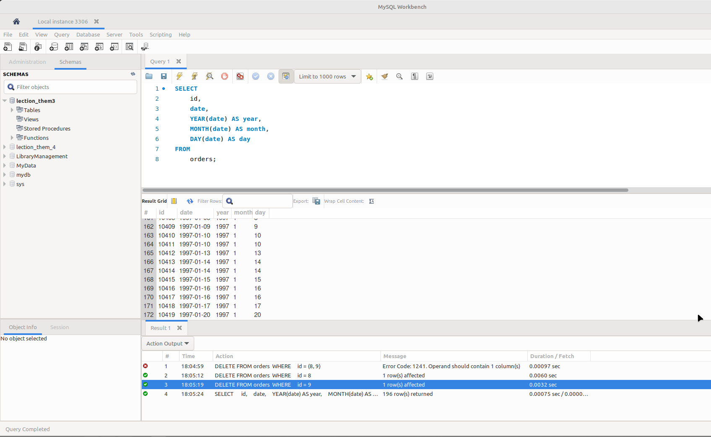
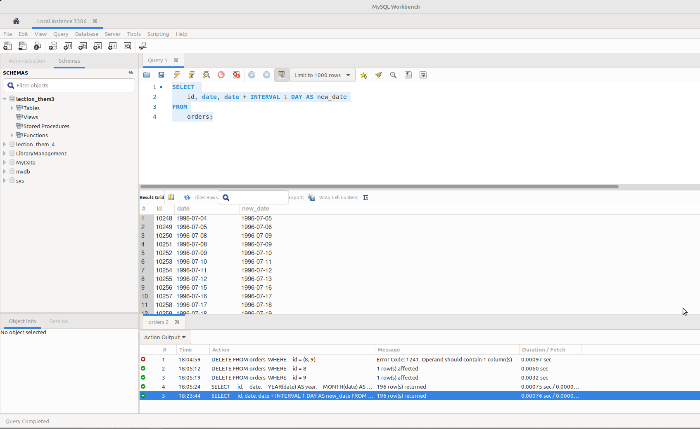
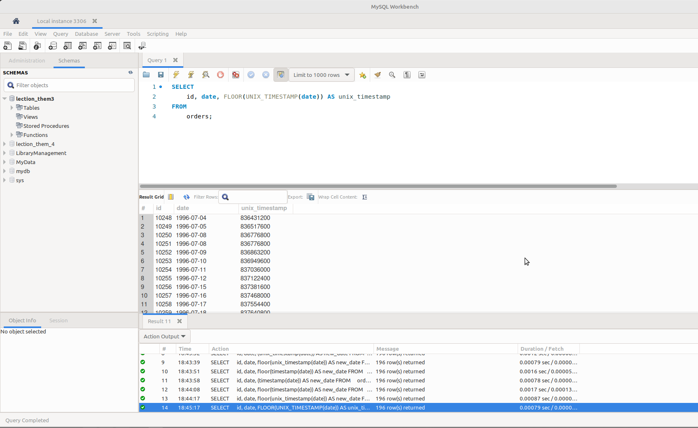
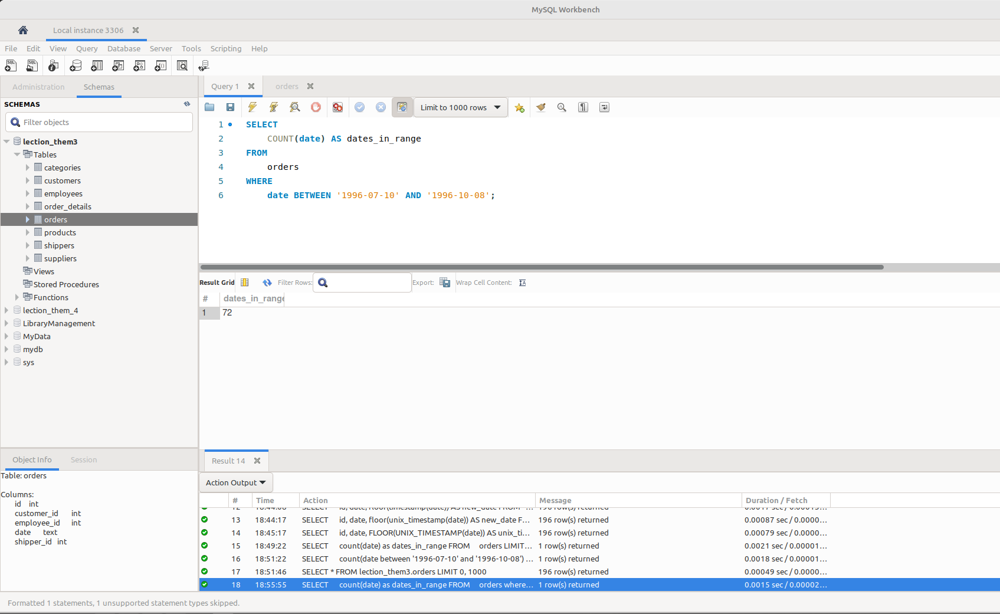

# goit-rdb-hw-07

Додаткові вбудовані SQL функції. Робота з часом:

### Завдання 1:

> Напишіть SQL-запит, який для таблиці orders з атрибута date витягує рік, місяць і число. Виведіть на екран їх у три окремі атрибути поряд з атрибутом id та оригінальним атрибутом date (всього вийде 5 атрибутів).

---

```sql
SELECT
    id,
    date,
    YEAR(date) AS year,
    MONTH(date) AS month,
    DAY(date) AS day
FROM
    orders;
```

_p1_date.png_


---

## Завдання 2:

> Напишіть SQL-запит, який для таблиці orders до атрибута date додає один день. На екран виведіть атрибут id, оригінальний атрибут date та результат додавання.

---

```sql
SELECT
    id, date, date + INTERVAL 1 DAY AS new_date
FROM
    orders;
```

_p2_plus_day.png_


---

## Завдання 3:

> Напишіть SQL-запит, який для таблиці orders для атрибута date відображає кількість секунд з початку відліку (показує його значення timestamp). Для цього потрібно знайти та застосувати необхідну функцію. На екран виведіть атрибут id, оригінальний атрибут date та результат роботи функції.

---

```sql
SELECT
    id, date, FLOOR(UNIX_TIMESTAMP(date)) AS unix_timestamp
FROM
    orders;
```

_p3_timestamp.png_


---

## Завдання 4:

> Напишіть SQL-запит, який рахує, скільки таблиця orders містить рядків з атрибутом date у межах між 1996-07-10 00:00:00 та 1996-10-08 00:00:00.

---

```sql
SELECT
    COUNT(date) AS dates_in_range
FROM
    orders
WHERE
    date BETWEEN '1996-07-10' AND '1996-10-08';
```

_p4_dates_in_range.png_


---

## Завдання 5:

> Напишіть SQL-запит, який для таблиці orders виводить на екран атрибут id, атрибут date та JSON-об'єкт {"id": <атрибут id рядка>, "date": <атрибут date рядка>}. Для створення JSON-об'єкта використайте функцію.

---

```sql

```

_p1_create_schema.png_


---
